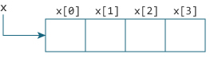

# Relationship Between Arrays and Pointers

## Relationship Between Arrays and Pointers

- Mảng là một khối dữ liệu tuần tự. Hãy xem một chương trình để in địa chỉ của các phần tử mảng.

    ```
    #include <stdio.h>
    int main()
    {
    int x[4];
    int i;
    for(i = 0; i < 4; ++i)
    {
        printf("&x[%d] = %p\n", i, &x[i]);
    }
    printf("Address of array x: %p", x);
    return 0;
    }
    ```

    output

    ```
    &x[0] = 0x7ffe592694c0
    &x[1] = 0x7ffe592694c4
    &x[2] = 0x7ffe592694c8
    &x[3] = 0x7ffe592694cc
    Address of array x: 0x7ffe592694c0
    ```

- Mỗi phần tử liên tiếp cách nhau 4 bytes bởi vì biến được khai báo kiểu dữ liệu int. 

- `&x[0]` và `x` là như nhau vì nó đều là giá trị cùng trỏ đến vị trí đầu tiên của mảng. 

    

    Như ảnh trên rõ ràng ta thấy `&x[0]` chính là x và x[0] là `*x`. Tương tự với x[1]..x[3].

## Ví dụ 1:


```
#include <stdio.h>
int main()
{
  int i, x[6], sum = 0;
  printf("Enter 6 numbers: ");
  for(i = 0; i < 6; ++i)
  {
  // Equivalent to scanf("%d", &x[i]);
      scanf("%d", x+i);
  // Equivalent to sum += x[i]
      sum += *(x+i);
  }
  printf("Sum = %d", sum);
  return 0;
}
```

output 

```
Enter 6 numbers: 1
2
3
4
5
6
Sum = 21
```

Ở đây, tôi đã khai báo một mảng x gồm 6 phần tử. Để truy cập các phần tử của mảng tôi đã sử dụng các con trỏ.

## Ví dụ 2:

```
#include <stdio.h>
int main()
{
  int x[5] = {10, 4, 3, 7, 9};
  int* ptr;
  // ptr is assigned the address of the third element
  ptr = &x[2]; 
  printf("*ptr = %d \n", *ptr);  
  printf("*ptr+1 = %d \n", *ptr+1); 
  printf("*ptr-1 = %d", *ptr-1);  
  return 0;
}
```

output 

```
*ptr = 3 
*ptr+1 = 4 
*ptr-1 = 2
```

## Ví dụ 3:

```
#include <stdio.h>
int main()
{
  int x[5] = {10, 4, 3, 7, 9};
  int *p;
  // ptr is assigned the address of the third element
  p = x;
  printf("add of p is: %p\n", p);
  int i;
  for (i = 0; i < 5; i++){
    printf("add of p[%d] is: %p\n", i, p+i );
    printf("value of *(p + %d) : %d\n",  i, *(p + i) );
   }
}
```

output

```
add of p is: 0x7ffe52611c70
add of p[0] is: 0x7ffe52611c70
value of *(p + 0) : 10
add of p[1] is: 0x7ffe52611c74
value of *(p + 1) : 4
add of p[2] is: 0x7ffe52611c78
value of *(p + 2) : 3
add of p[3] is: 0x7ffe52611c7c
value of *(p + 3) : 7
add of p[4] is: 0x7ffe52611c80
value of *(p + 4) : 9
```

## Ví dụ 4:

```
#include <stdio.h>
int main()
{
  int x[5] = {10, 4, 3, 7, 9};
  int *p;
  // ptr is assigned the address of the third element
  p = &x[2];

  printf("---------------------------------------\n");
  printf("add of p[%d] is: %p\n", 0, p );
  printf("value of *(p + %d) : %d\n",  3, *(p) );
  printf("---------------------------------------\n");
  printf("add of p[%d] is: %p\n", 1, p );
  printf("value of *(p + %d) : %d\n",  2, *(p - 1) );
  printf("---------------------------------------\n");
  printf("add of p[%d] is: %p\n", 1, p );
  printf("value of *(p + %d) : %d\n",  4, *(p + 1) );
  printf("---------------------------------------\n");
}
```

output 

```
---------------------------------------
add of p[0] is: 0x7ffec486e768
value of *(p + 3) : 3
---------------------------------------
add of p[1] is: 0x7ffec486e768
value of *(p + 2) : 4
---------------------------------------
add of p[1] is: 0x7ffec486e768
value of *(p + 4) : 7
---------------------------------------
```